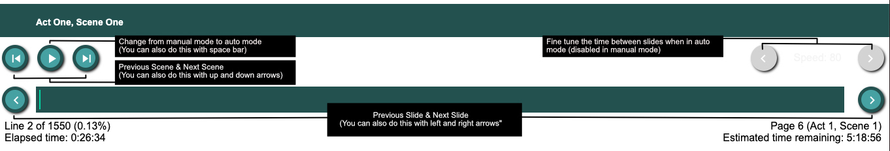
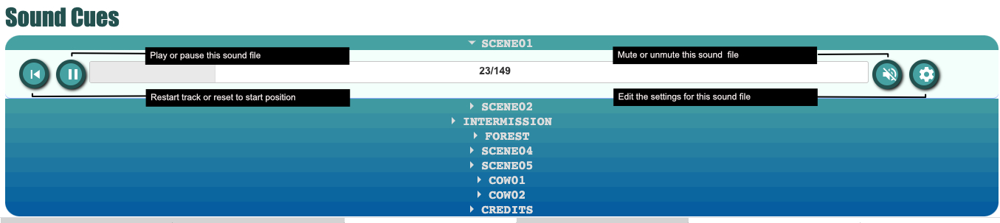

<!DOCTYPE html>
<html>
<head>
<meta http-equiv="Content-Type" content="text/html; charset=utf-8">
</head>
<body>
<h1>Subscript Documentation</h1>

Subscript is a DIY subtitle and audio cuing system for theatre.  Using a custom markup, it reads in a text file and automatically generates slideshow line by line.

<h2>Contents</h2>
<ol>
<li><a href="#basicOp">Basic Operation</a></li>
<li><a href="#usingCon">Using the Controller</a></li>
<li><a href="#monSetup">Display Setup</a></li>
<li><a href="#textAnno">Text File Annotation</a></li>
<li><a href="#compat">Compatabilty</a></li>
<li><a href="#licensing">Licensing</a></li>
<li><a href="#future">Future Development</a></li>
<li><a href="#zip">Download Files</a></li>
<ol>

<h2>1. Basic Operation</h2>
After opening the <a href="index.php" target="_blank">Subscript frontend</a> you will see the first page of the slideshow. By default the webpage is in "manual mode". You can use the spacebar to switch between automatic and manual mode.  

In <b>automatic mode</b>, the length of time each subtitle is displayed is determined by the number of characters in the line.  In this mode you can fine tune the speed at which the subtitles are displayed using the left and right arrow keys.  At the start of each new scene manual mode is automatically activated, pausing the subtitles.
     

In <b>manual mode</b> you can use the keyboard to progress through your Subscript slideshow.  The left arrow takes you to the previous slide and the right arrow takes you to the next slide.  The up arrow takes you to the previous scene or title card and the down arrow takes you to the next scene or title card.  Press the number keys to jump to a specific scene or title card.

<h2>2. Using the Controller</h2>
Some functionality is unavailable when using the frontend on its own.  The Subscript controller adds additional features, including an audio cue manager and a more intuitive UI.  When the frontend is opened, you will see a question appear at the bottom of the screen - "Open Subscript control interface?".  Click "yes" to open the controller.   You will see the following arrangement of buttons and UI elements at the top of the screen.

The dark grey box with the white text at the top of the image shows the subtitle currently being displayed by the frontend.  The other dark grey box is a progress bar, displaying how far through the subtitle file you have progressed.  Below that, on the left is displayed the current line number you are on in that file as well as the time elapsed since you started the slideshow.  On the right is an estimate of the time remaining based on your progress as well as the current page, scene and act number in the scripts hardcopy.

In addition to the buttons shown above, you can use the keyboard to navigate your slide show in the same way you did when using the frontend.

<h3>Audio Cue Manager</h3>
The Subscript controller also includes an audio cue manager.  When the controller encounters an SFX tag on the current line of the subtitle file it will automatically start playing it.  Audio cues can also be played, paused or muted manually using the appropriate button. 

To play or view details for a track other than the one that is currently playing simply find the track you want in the audio cue list and click the triangle next to the track title.  To alter track volume, start time, duration, how long to delay before playing, fade in, fade out or to toggle track looping click on the settings icon.

<b>NB:</b>Audio playback requires Subscript controller.  The frontend does not have this capability on its own.

<h2>3. Display Setup</h2>
Before using the Subscript controller and frontend together you will need to setup your displays so that the audience can only see the frontend and you can still see the controller.  To do this you will need to disable display mirroring. Click <a href="https://www.sweetwater.com/sweetcare/articles/how-do-i-disable-display-mirroring-on-my-macpc/" target="_blank">here</a> to open a link describing how to do this on Mac and PC.

Once you've done that you will need to position the window for the Subscript frontend on the display or projector the audience can see while leaving the controller on your own display.  Usually this is just a matter of dragging the window from one display to the other.  Once you have the frontend window on the correct display, click on it to make sure it is active and then put it in fullscreen mode.  Click <a href="https://www.digitalcitizen.life/web-browser-fullscreen/" target="_blank">here</a> to open a link explaining how to put your browser in fullscreen.

<h2>4. Text File Annotation</h2>
Subscript reads in a plaintext file<a href="#note1">*</a> which has been annotated using a custom markup.  Each line of the text file is used to generate a new slide in the slideshow. There are currently 4 different kinds of tags.
<ol>
<li><b>Scene Tags</b> Scene tags are used for creating title cards,  You can create a scene tag by placing the text that you want on the title card inside square brackets like so:<blockquote>[Scene One, Act Two]</blockquote></li>
<li><b>Location Tags</b> Location tags are used to encode page, scene and act information from the paper hardcopy of the script into the subtitle file.  Location tags are enclosed in pointy brackets and should be included at the end of the first line of each page of the script, like so:<blockquote>  Tituba: 我的小贝蒂很快就会好吗? &ltLOC act:1 scene:1 p:6&gt Parris: 出去! Tituba: 我的小贝蒂不至于死吧</blockquote></li>
<li><b>Background Image Tags</b> BGI tags are used to load an image into the background of a series of slides.  Currently image tags must be included on a line of their own and cannot be used with title card slides.  Usually a BGI tag should be placed on the line following a scene tag and will be used for all the slides in that scene.  BGI tags are also enclosed in pointy brackets and must include the url of the image you wish to load, like so:<blockquote>[Act One, Scene One] &ltBGI images/img01.jpg&gt</blockquote></li>
<li><b>Audio tags</b> SFX tags are used to load a music or sound effect file.  The file is played automatically when the Subscript controller reaches the line that the SFX tag is on.  SFX tags are enclosed in  pointy brackets and must include the url of image you wish to load like so:<blockquote>[The Crucible, by Arthur Millar]&ltSFX url=music/scene01.mp3&gt</blockquote>In addition, the following options may also be used to fine tune how and when the track is played.
<ul><li><b>Fade Up and/or Fade Down:</b> Fades the volume up when a track starts playing or down before it stops.  The duration of the fade is specified in seconds, like so:<blockquote>&ltSFX url=music/scene01.mp3 fadeUp=5 fadeDown=5&gt</blockquote>If they are not set they default to 0. <b>NB:</b>The capitalisation of fadeUp and fadeDown is important here.</li>
<li><b>Delay:</b> Waits a specified number of seconds before playing the track.  For example:<blockquote>&ltSFX url=music/scene01.mp3 delay=3&gt</blockquote>If it is not set it defaults to 0.</li>
<li><b>Start Time:</b> Jump to a specific start position in the track.  This is also specified in seconds, like so:<blockquote>&ltSFX url=music/scene01.mp3 startT=5&gt</blockquote>If it is not set it defaults to 0.</li>
<li><b>Duration:</b> Will stop the track after a set number of seconds.  For example:<blockquote>&ltSFX url=music/scene01.mp3 duration=5&gt</blockquote>If it is not set it defaults to 0.</li>
<li><b>Volume:</b> Set the playback volume.  This value must be a value between 0 and 100, like so:<blockquote>&ltSFX url=music/scene01.mp3 volume=50&gt</blockquote>If it is not set it defaults to 100.</li>
<li><b>Loop:</b> Turn looping off or on.  This value must be either "true" or "false".  For example:<blockquote>&ltSFX url=music/scene01.mp3 loop=true&gt</blockquote>If it is not set it defaults to false.</li>
</ul>
</li>
</ol>

HTMl tags can also be used to style the text in the subtitle file.  Click <a href="https://flaviocopes.com/html-text-tags/" target="_blank">here</a> for a basic guide on html text styling tags.

<a href="#origin1">^</a>If you don't know how to create a plaintext file, click <a href="https://debounce.io/resources/help-desk/acceptable-files/txt/"target="_blank">here</a> for an article explaining the process

<h2>4. Compatibility</h2>
Subscript has been tested on Safari, Chrome and Firefox for Mac.  The frontend functions well on all three but the controller can be somewhat unresponsive on Safari.  To run your own installation of Subscript you need a webserver with php enabled.

<h2>5. Licensing</h2>
Subscript is licensed under a <a href="https://creativecommons.org/licenses/by-nc-sa/3.0/" target="_blank">Creative Commons NonCommercial-ShareAlike License</a>.  You are free to:<ul><li>Share — copy and redistribute the material in any medium or format</li><li>Adapt — remix, transform, and build upon the material.</li></ul>
Under the following conditions:<ul><li>Attribution — You must give appropriate credit, provide a link to the license, and indicate if changes were made. You may do so in any reasonable manner, but not in any way that suggests the licensor endorses you or your use.</li><li>NonCommercial — You may not use the material for commercial purposes.</li><li>ShareAlike — If you remix, transform, or build upon the material, you must distribute your contributions under the same license as the original.</li><li>No additional restrictions — You may not apply legal terms or technological measures that legally restrict others from doing anything the license permits.</li></ul>

<h2>6. Future Development</h2>
One feature I'd like to include is a more user friendly method for marking up the subtitle file.  I would also like figure out a way to fix the responsiveness issues on safari. 

<h2>6. Download Files</h2>
You can download the zip file of the demo <a href="files/subscript.zip">here</a>

</body>
</html>
 
